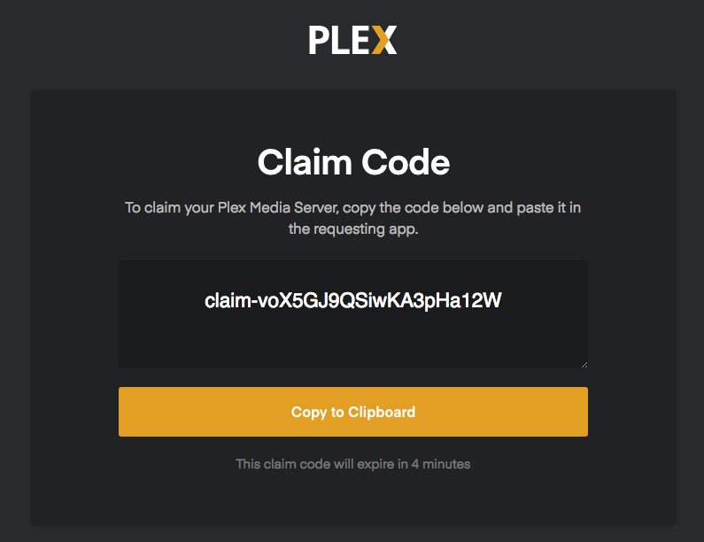

# Plex Access Token

The following guide mentions two ways of obtaining a Plex Access Token for your Plex account.

## From Plex website

1. Go to https://plex.tv/claim
2. Log in if need be
3. A claim code will be displayed:



## Cloudbox Role

You will need your Plex credentials filled in `~/cloudbox/accounts.yml`. If you already do, skip steps 2-4.

1. Go to the Cloudbox folder:

   ```bash
   cd ~/cloudbox/
   ```

2. Open the file for editing:
   * ```bash
     nano accounts.yml
     ```
3. Fill in your Plex credentials:

   ```text
   plex:
     user:
     pass:
   ```

4. Save and exit: Ctrl + X Y Enter.
5. Run the following command:

   ```text
   cb install plex_auth_token
   ```

6. You will be shown your Plex Access Token in the log:

   ```text
   TASK [plex_auth_token : Display Plex Auth Token] 
   ***********************************************************************************
   Tuesday 29 January 2019  21:08:33 +0100 (0:00:00.104)       0:00:13.905 *******
   ok: [localhost] => {
       "msg": "Your Plex Auth Token is: XXXXXXXXXXXXXXXX"
   }
   ```

## Script

1. On the server's shell, run the following command[\[1\]](plex-access-token.md#note1):

   ```bash
   /opt/scripts/plex/plex_token.sh
   ```

2. You will be prompted to enter your Plex login and then presented with the Plex Access Token \(under `Your X_PLEX_TOKEN:`\)

 [1](plex-access-token.md#note1ref) Credit: [https://github.com/wernight](https://github.com/wernight)  


